<p align="center">
  
</p>

<br>

<p align="center">
  
</p>

<br>

```yaml
alias    : Alpha
role     : Product Strategist  ·  AI Founder  ·  Full-Stack Engineer
thesis   : Systems that compound while you sleep.
edge     : "Finding the one decision quietly bleeding your revenue dry."
status   : Building AI products/startups  [stealth]
education: B.Tech CSE
```

<br>

---

<br>

**`//  HOW I OPERATE`**

> &nbsp; I find the one decision quietly bleeding your revenue dry.
> &nbsp; I build systems that run empires - autonomously.
> &nbsp; I see moves most people don't. Before they happen.

<br>

---

<br>

**`//  MILESTONES`**

<table>
  <tr>
    <td align="center" width="200"><h2>🏆 19</h2><sub>Beat 50+ teams.<br/>First major win.</sub></td>
    <td align="center" width="200"><h2>📈 21</h2><sub>Advising BCG &<br/>Accenture.</sub></td>
    <td align="center" width="200"><h2>⚔️ 50+</h2><sub>Teams outperformed.<br/>Pure Domination.</sub></td>
    <td align="center" width="200"><h2>🔥 ∞</h2><sub>Still not<br/>satisfied.</sub></td>
  </tr>
</table>

<br>

---

<br>

<h3 align="center">// &nbsp; TECH STACK &nbsp; //</h3>

<p align="center">


  
  
  
  
  


  
  
  
  
  


  
  
  
  
  
  
  


  
  
  
  
  
  
  
  


  
  
  
  


  
  
  
  
  
  


  
  
  
  
  


  
  
  
  

</p>

<br>

---

<br>

**`//  OPEN TO`**

<p align="left">
&nbsp;&nbsp;→ &nbsp;<strong>Founder's Office</strong> &nbsp;&nbsp;→ &nbsp;<strong>Product Manager</strong> &nbsp;&nbsp;→ &nbsp;<strong>AI Engineer</strong> &nbsp;&nbsp;→ &nbsp;<strong>Software Engineer</strong> &nbsp;&nbsp;→ &nbsp;<strong>Project Manager</strong> &nbsp;&nbsp;→ &nbsp;<strong>Strategic Consulting</strong>
</p>

```
Not chasing roles but ownership - creating leverage. Open to the right room.
```

<br>

---

<br>

**`//  CURRENTLY BUILDING`**

```
AI products at the intersection of autonomous systems + real business leverage.
Stealth mode. Watching.
```

<br>

---

<br>

**`//  LET'S CONNECT`**

<p align="left">
  <a href="https://www.linkedin.com/in/sparshalpha">
    
  </a>
</p>

<br>

---

<br>

<p align="center">
  
</p>
